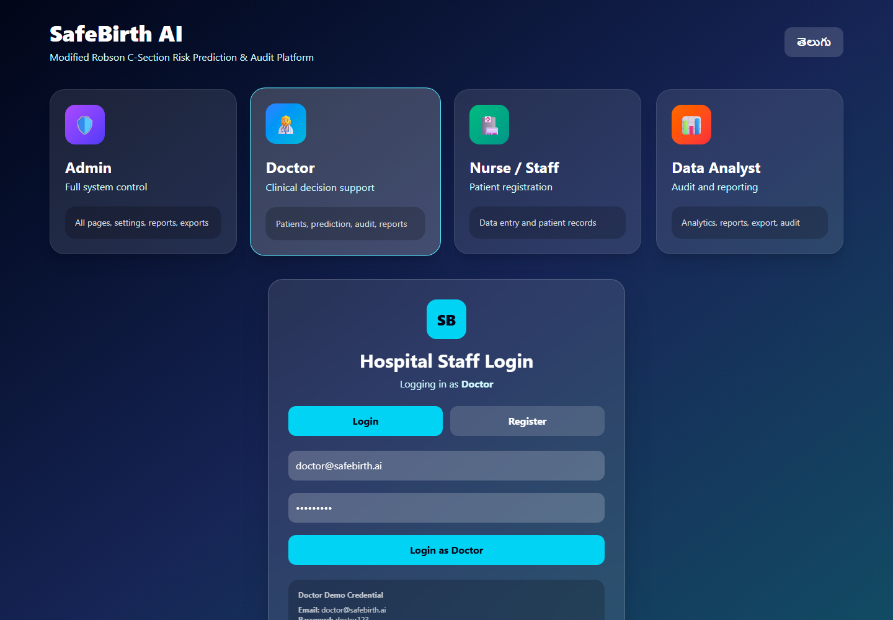
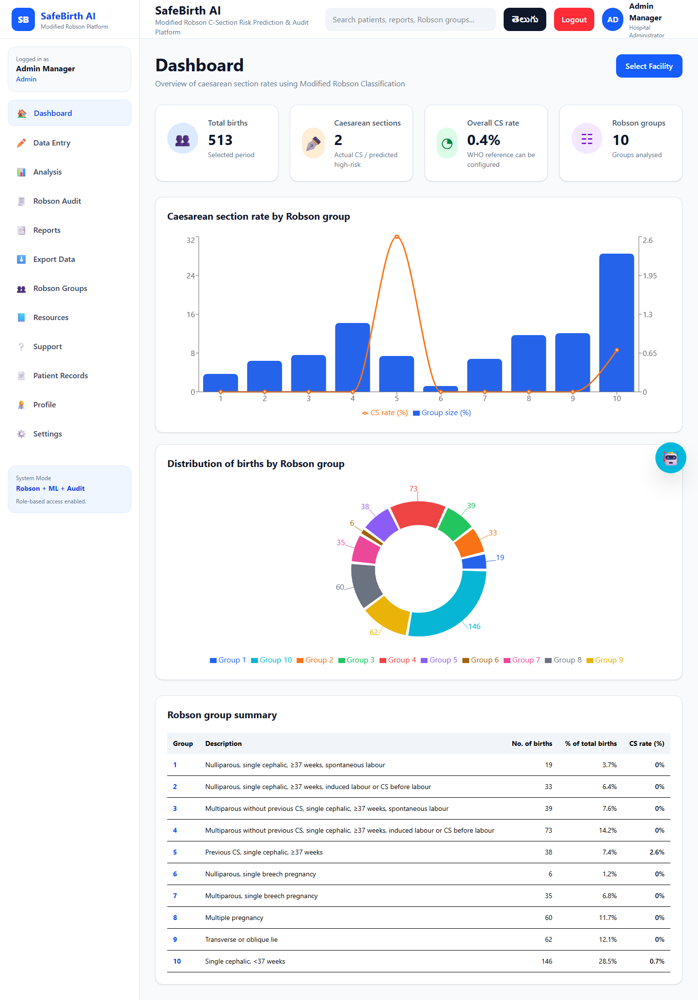
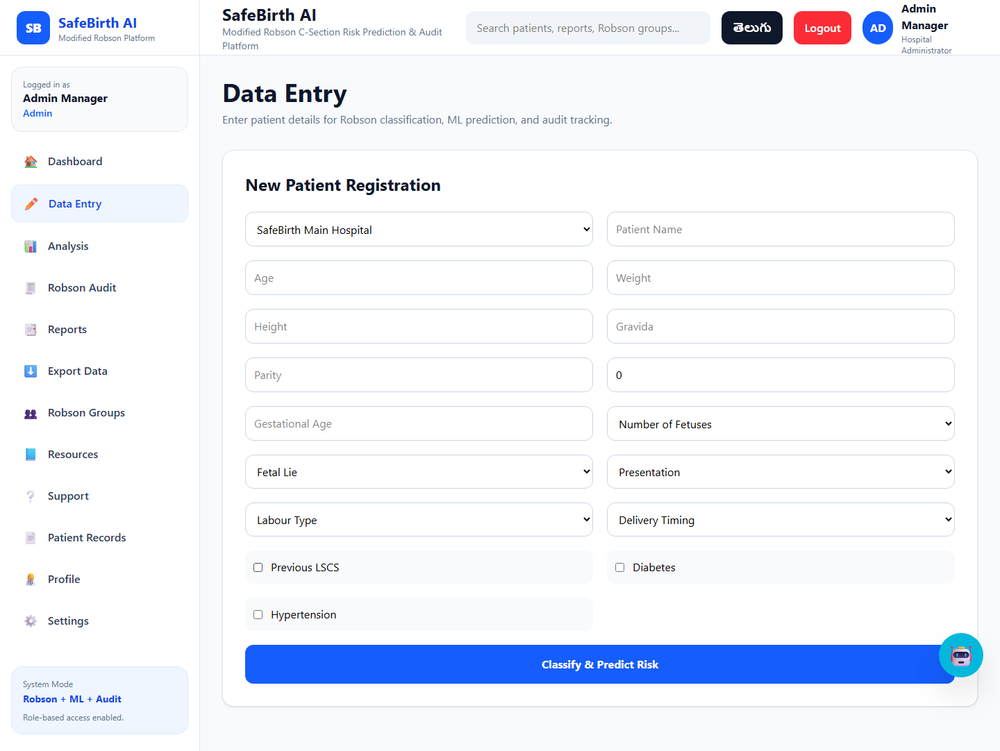
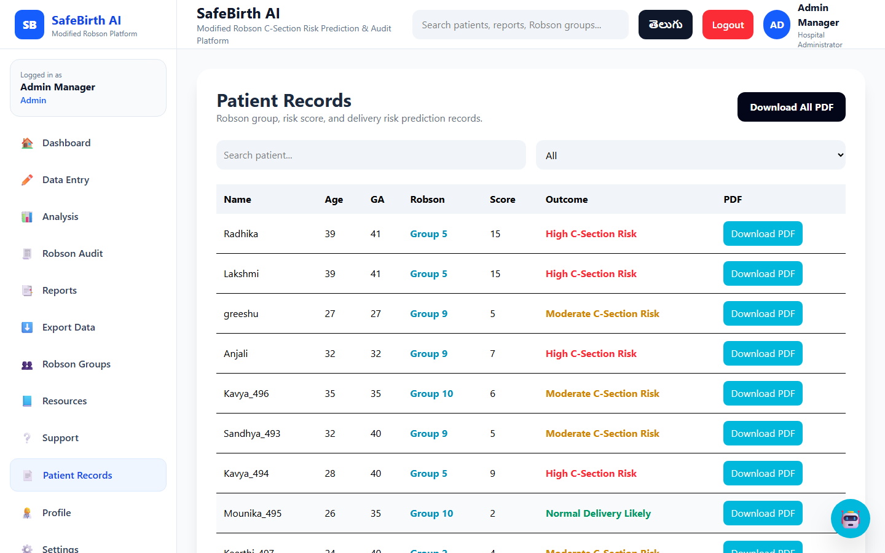
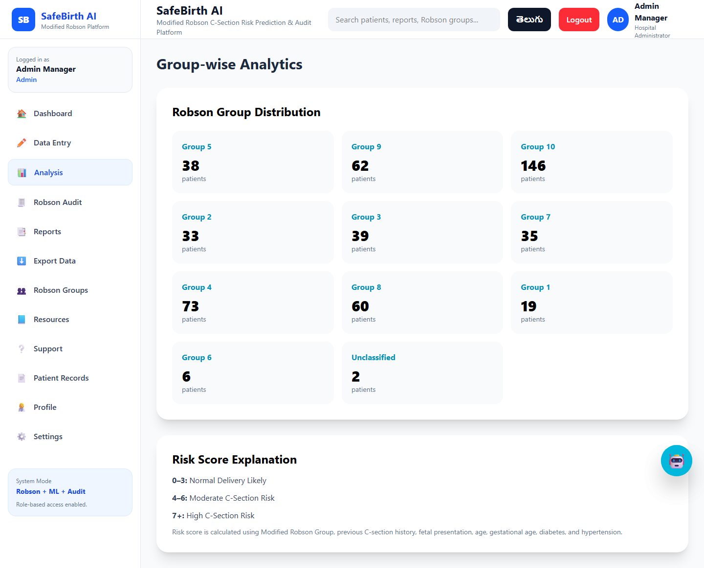
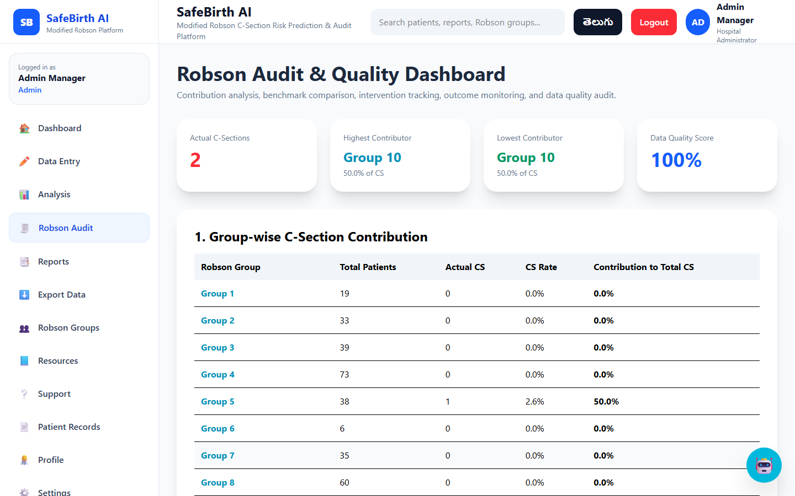
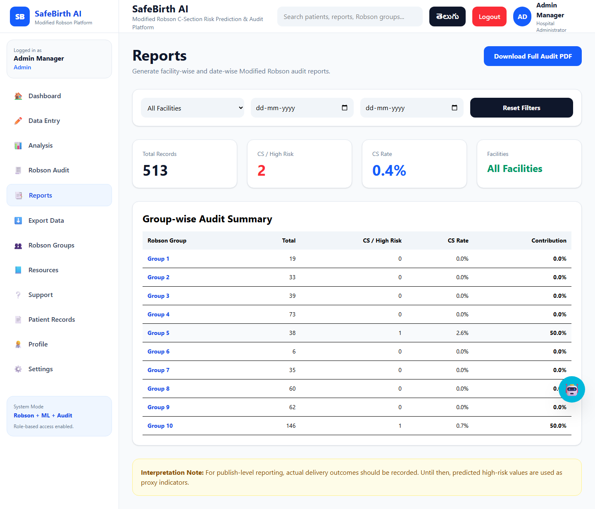
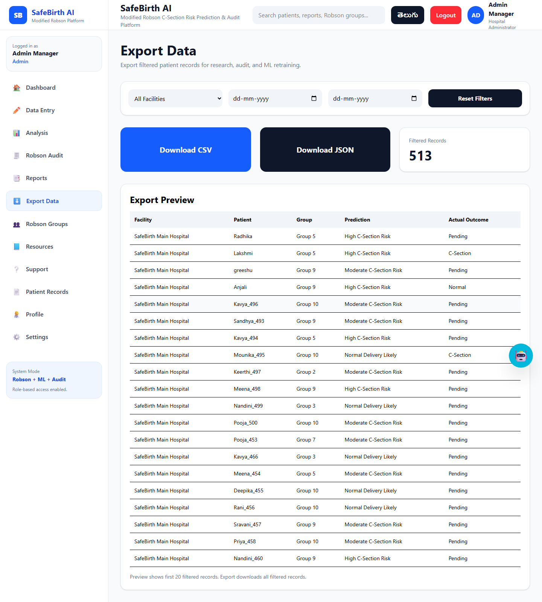
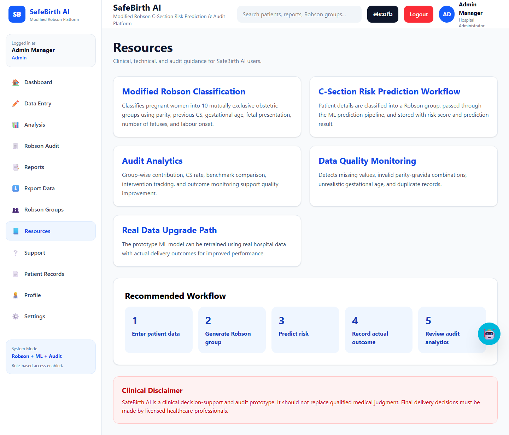
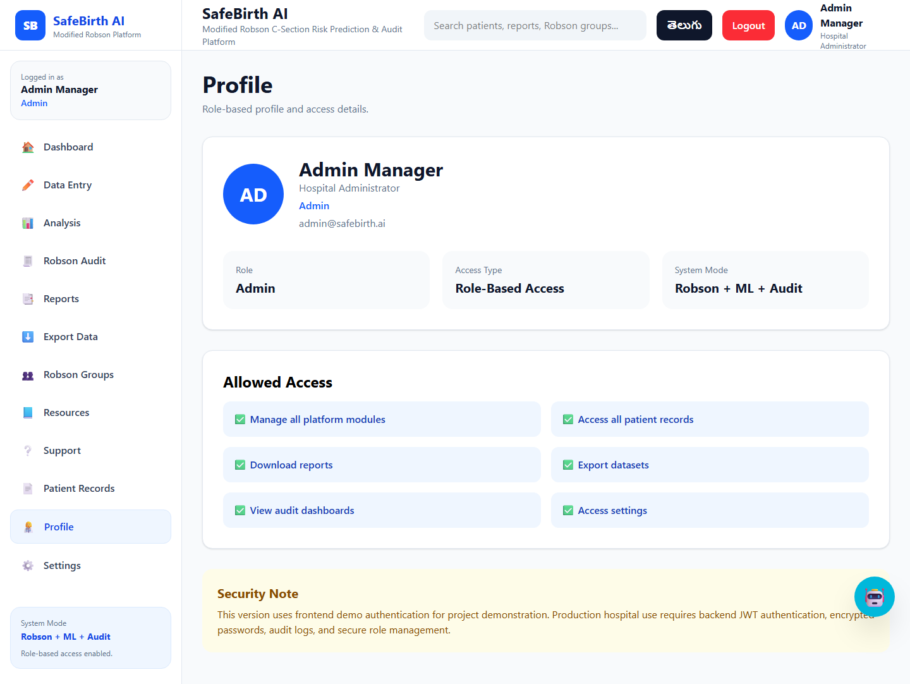

# SafeBirth AI – C-Section Risk Prediction & Robson Audit Platform

SafeBirth AI is a deployed full-stack healthcare prototype for C-section risk prediction and Modified Robson Criteria based audit analytics. The platform allows hospital staff to enter patient data, classify patients into Robson groups, predict delivery risk, monitor high-risk cases, generate reports, export data, and analyze group-wise C-section trends.

> This project is a clinical decision-support and audit prototype. It is not a replacement for qualified medical judgment.

---

## Live Links

- **Live Demo:** https://safebirthai-frontend.vercel.app/
- **Backend API:** https://riskprediction-backend.vercel.app
- **ML Health Check:** https://riskprediction-ml.vercel.app/health
- **GitHub Repository:** https://github.com/Greeshmasree76/RiskPrediction

---
## Screenshots

### Login Page


### Dashboard


### Data Entry


### Patient Records


### Analytics


### Robson Audit


### Reports


### Export Data


### Resources


### Profile


---
## Demo Access

The live application includes role-based demo login options directly on the login page.

Available roles:

- Admin
- Doctor
- Nurse / Staff
- Data Analyst

Each role has different access permissions based on responsibility.

---

## Key Features

- Role-based login for Admin, Doctor, Nurse/Staff, and Data Analyst
- Real-time patient data entry
- Modified Robson group classification
- ML-based prototype C-section risk prediction
- High-risk alert popup
- Patient records dashboard
- Robson group-wise audit analytics
- Benchmark comparison and intervention tracking
- Actual delivery outcome and care-quality tracking
- PDF reports and CSV/JSON export
- Telugu / English language support


---

## Tech Stack

**Frontend:** React.js, Tailwind CSS, React Router, Recharts  
**Backend:** Node.js, Express.js, MongoDB Atlas, Mongoose  
**ML Service:** Python Flask, scikit-learn, pandas, joblib  
**Deployment:** Vercel

---

## Project Architecture

```text
React Frontend
      ↓
Node.js / Express Backend
      ↓
Python Flask ML Service
      ↓
MongoDB Atlas Database